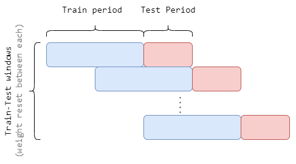
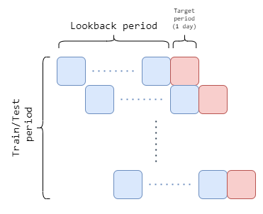

## About the Project
Rolling LSTM modelling framework for stock data prediction using candlestick data, technical indicators, and macroeconomic indicator.

## Requirements & Run
1. Install python >= 3.9.* and latest [pip](https://pip.pypa.io/en/stable/installation/). Preferably using [miniconda](https://conda.io/projects/conda/en/latest/user-guide/install/index.html).

2. Install required padckages using pip: `pip install -r requirements.txt`

3. Download data and place it to `data/raw`. Otherwise, sample data is already in the repository.

4. Run `main.py`

---

- Example financial time series data: (NDX OHLCV candlestick) [[yahoo finance]](https://finance.yahoo.com/quote/%5ENDX/history?p=%5ENDX)

- Initial Claims time series data [[Initial Claims - Federal Reserve Bank of St. Louis]](https://fred.stlouisfed.org/series/ICSA)

## Description of modules

**1. `src.data.preprocessing`**

*Input: raw datasets (csv): `config[raw]` -> `data/raw`*

    This module preprocesses and joins datasets: 
    OHLCV, Initial Claims (ICSA), Technical Indicators, and transforms the target variable. 

*Output: joined dataset (pkl, csv) `config[prep][JoinedDfPkl]` -> `data/input/joined.pkl`*

**2. `src.data.windowSplit`**

*Input: joined dataset (pkl) `config[prep][JoinedDfPkl]` -> `data/input/joined.pkl`*

    This module splits the dataset into train and test windows. 
    There are 3 parameters to consider: lookback, train-window, test-window.
    First of all, data is divided into train-test windows in a way that training period of next window moves 
    over a test period of the previous window (see diagram #1 below).

    Moreover, each train and test period is also handled using the rolling window approach (see diagram #2 below).

    This approach utilizes lookback period which allows the model to train on small batches of recent data.

*Output: window split dictionary (pkl): `config[prep][WindowSplitDict]` -> `data/input/window_split.pkl`*

**3. `src.model.modelFitPredict`**

*Input: window split dictionary (pkl): `config[prep][WindowSplitDict]` -> `data/input/window_split.pkl`*

    The module utilizes keras Sequential model:
    builds the framework, trains it on window data, and generates predictions using hyperparameters from config.ini. 

*Output:* 
- *numpy array of predictions (pkl): `config[prep][PredictionsArray]` -> `data/output/latest_preds.pkl`*
- *data-to-evaluate (csv, pkl): `data/output/model_eval_data_<timestamp>.pkl`*
- *model configuration (json): `reports/model_config_<timestamp>.json`*

**3.1 `src.model.performanceMetrics`**

*Input: data-to-evaluate (pkl): `data/output/model_eval_data_<timestamp>.pkl`*

    Calculates Equity Line and performance metrics: 
    - Annualized Return Ratio, 
    - Annualized Standard Deviation, 
    - Information Ratio, 
    - Maximum Loss Duration

*Output:*
- *Performance metrics dictionary (json): `reports/performance_metrics_<timestamp>.json`*
- *Equity Line array (pkl): `data/output/eq_line_<timestamp>.pkl`*

**4 `src.visualization.plotResults`**

*Input:* 
- *data-to-evaluate (pkl): `data/output/model_eval_data_<timestamp>.pkl`*
- *window split dictionary (pkl): `config[prep][WindowSplitDict]` -> `data/input/window_split.pkl`*
- *model configuration (json): `reports/model_config_<timestamp>.json`*
- *Performance metrics dictionary (json): `reports/performance_metrics_<timestamp>.json`*
- *Equity Line array (pkl): `data/output/eq_line_<timestamp>.pkl`*

    Visualizes results. 
    Includes information about model configuration, comparison between real vs predicted data, and performance metrics.

*Output:*
- *Equity Line plot (png): `reports/figures/equity_line_<timestamp>.png`*
- *Predictions histogram (png): `reports/figures/predictions_histogram_<timestamp>.png`*

## Remarks

Further improvements to be included:

- [ ] Averaging the results from many runtimes (random seed cannot be currently set due to the large amount of stochastic processes)

- [ ] Hyper-param tuning between windows

- [ ] Real time approach

  

## License

  

MIT License | Copyright (c) 2021 Jan Androsiuk